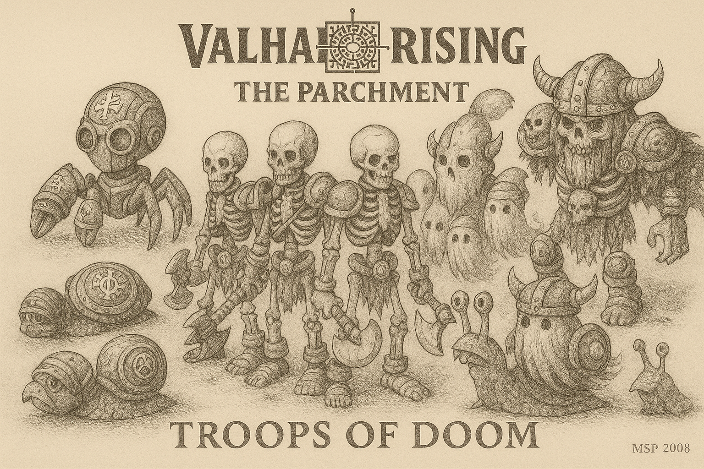

  

---

# 💀 TROOPS OF DOOM  
### 🇨🇦 EN-CA | 🇨🇦 FR-CA

## 🧩 Introduction (EN-CA)  
The **Troops of Doom** are the marching horror of Valhalla Rising.  
Forged in chaos, built with ancient tech and necromantic energy, these entities fill the lanes, jungle and objectives with unrelenting dread.

This repository documents their design, behavior, spawn logic and variations by tier and biome.

---

## 🛡️ Troop Types  
- **Arachnobots**: skittering metal constructs with AI-based tracking  
- **Crab Mechs**: rune-forged crustaceans with high armor  
- **Ghost Wraiths**: spectral beings, fast and evasive  
- **Snail Tanks**: slow, cursed tanks with rune-shells  
- **Skeleton Squads**: mindless undead warriors  
- **Leif** (Super Minion): an elite dark guardian of the lane

---

## 🇨🇦 VERSION FR-CA ↓

## 🧩 Introduction (FR-CA)  
Les **Troupes du Destin** sont les horreurs mécaniques de Valhalla Rising.  
Forgées dans le chaos et animées par la nécromancie, ces entités déferlent sur les routes et la jungle, semant la peur et la destruction.

Ce dépôt documente leur conception, comportement, logique d’apparition et leurs variantes selon le biome et le niveau.

---

## 🛡️ Types de troupes  
- **Arachnobots** : créatures mécaniques rapides et traçantes  
- **Crabes Runés** : crustacés massifs dotés d’armures mystiques  
- **Spectres** : âmes errantes, rapides et insaisissables  
- **Escargots blindés** : lents mais indestructibles  
- **Squelettes** : soldats morts-vivants animés par magie noire  
- **Leif** (Super Minion) : gardien sombre d’élite des routes

---

## ✍️ Credits  
Art by **MSP – Marcelo dos Santos Prado**, 2008.  
Designed in pencil, forged in shadow.

---
